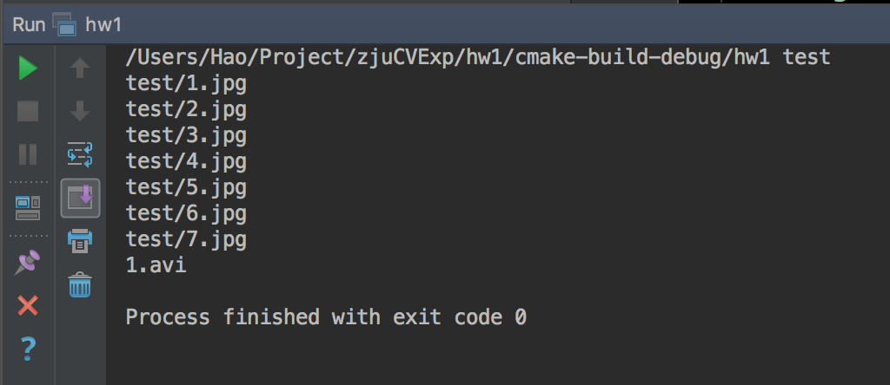
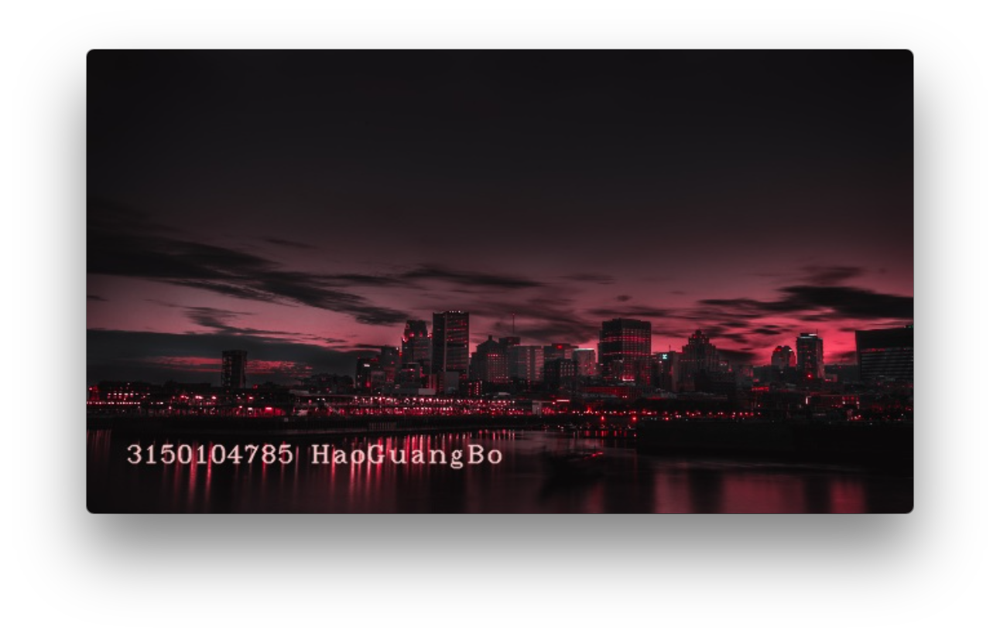
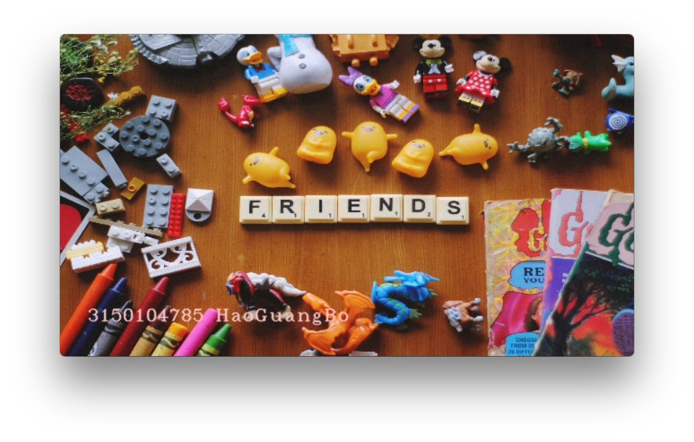
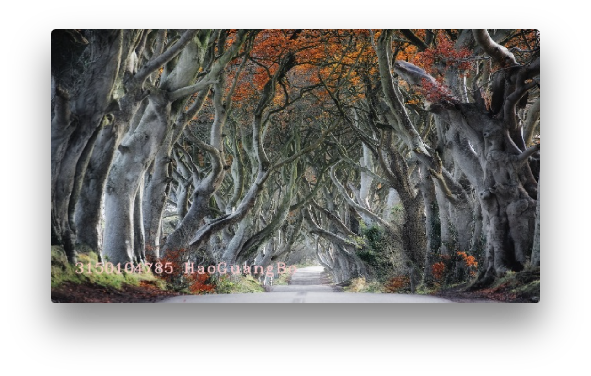
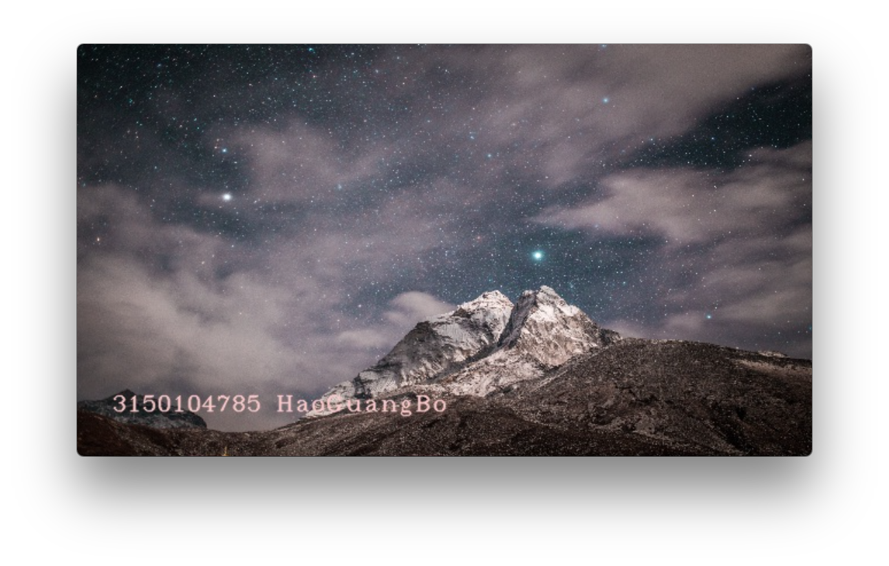
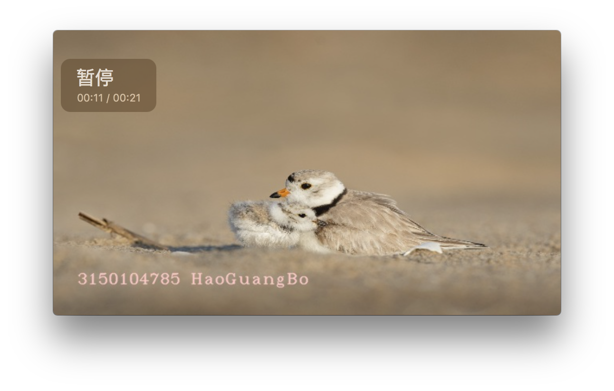
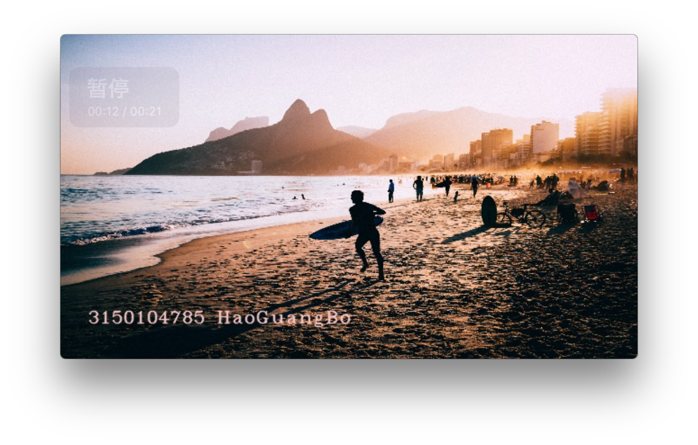
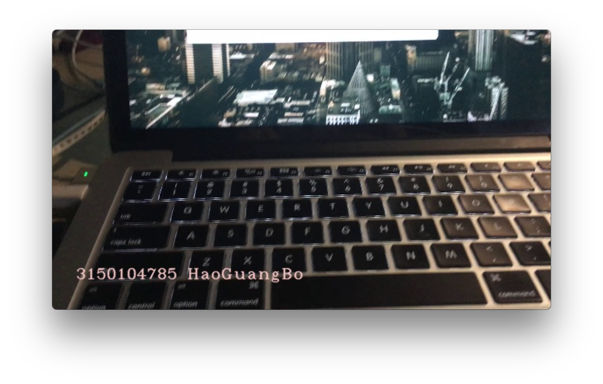

# 实验1实验报告

郝广博 3150104785

## 实验目的和要求

## 实验环境

- macOS 10.12
- cmake 3.8
- openCV 3.3

## 实验步骤

### 配置环境

1. 通过`brew install opencv`安装opencv

2. 编写`CMakeLists`来引入OpenCV：

   ```cmake
   find_package( OpenCV REQUIRED )
   include_directories( ${OpenCV_INCLUDE_DIRS} )
   ```

3. 编写一个简单的程序测试一下openCV

### 代码实现

代码主要是由四部分构成：

#### 初始化video writer

```c++
VideoWriter writer;
bool isColor = true;
int frameFps = 30;
int frameWidth = 640;
int frameHeight = 360;
Size finalSize = Size(frameWidth,frameHeight);
string videoName = "out.avi";
writer = VideoWriter(videoName, CV_FOURCC('M', 'J', 'P', 'G'), frameFps, finalSize,isColor);
```

配置画面大小为650×360（16:9），帧率为30，彩色，输出文件名为`out.avi`。

#### 把图片连接成幻灯片

```c++
int i = 0;
Mat img;
while (true) {
    sprintf(imagePath, "%s/%d.jpg", argv[1], ++i);
    img = imread(imagePath);//read images
    if (!img.data) {
        break;
    }
    cout << imagePath <<endl;
    Mat imgResized;
    resize(img, imgResized, finalSize);
    putText(imgResized, "3150104785 HaoGuangBo", cvPoint(30,320), FONT_HERSHEY_COMPLEX_SMALL, 1.0, cvScalar(200,200,250), 1, CV_AA);
    for(int j=0; j<60; j++){// 60 frames = 2 seconds
        writer.write(imgResized);
    }
}
```

依次读取文件夹中的jpg图片到`Mat img`中，然后再通过`resize()`函数对`img`的大小进行调整，使其适配视频预设的大小。然后再通过`putText()`函数在画面底部加上字幕。最后，对每一张图片，写入60帧，也就是2秒。

#### 视频处理

```c++
char videoPath[200];
sprintf(videoPath, "%s/1.avi", argv[1]);
VideoCapture capture = VideoCapture(videoPath);
Mat frame,frameResized;
cout<<"1.avi"<<endl;
if( !capture.isOpened() ){
    throw "Error when reading avi";
}
while(true) {
    capture >> frame;
    if(frame.empty())
        break;
    resize(frame, frameResized, finalSize);
    putText(frameResized, "3150104785 HaoGuangBo", cvPoint(30,320), FONT_HERSHEY_COMPLEX_SMALL, 1.0, cvScalar(200,200,250), 1, CV_AA);
    writer.write(frameResized);
}
```

首先初始化一个`VideoCapture`，读取`1.avi`。然后，通过`capture >> frame;`依次读取到每一帧的数据。接下来，对这一帧进行resize和putText的操作（这和上一个部分图片处理中的操作是一样的）。最后，把这一帧写入到视频文件中。

#### 释放video writer

```c++
writer.release();
```

## 实验结果

编译运行：



发现程序把test文件夹下的七张照片和一段视频处理后合成了一个视频，保存为了`out.avi`：


查看输出的视频文件：
















前几张截图是静态的图片做成的幻灯片，最后一张截图是视频。

## 讨论和分析

在通过videoWriter把帧写入到视频文件中时，一开始我遇到了如下报错：

> OpenCV Error: Assertion failed (img.cols == width && img.rows == height && channels == 3) in write, file /tmp/opencv-20171112-69002-161xh9l/opencv-3.3.1/modules/videoio/src/cap_mjpeg_encoder.cpp, line 837
> libc++abi.dylib: terminating with uncaught exception of type cv::Exception: /tmp/opencv-20171112-69002-161xh9l/opencv-3.3.1/modules/videoio/src/cap_mjpeg_encoder.cpp:837: error: (-215) img.cols == width && img.rows == height && channels == 3 in function write

查阅相关资料后发现是因为没有把frame的大小resize为和预先设置的一样。通过`resize(img, imgResized, finalSize);`拿到`imgResized`，就可以正常写入到视频文件中了。

总得来说openCV提供了很多非常方便的函数，可以让我们轻松的实现对图像和视频的各种操作。