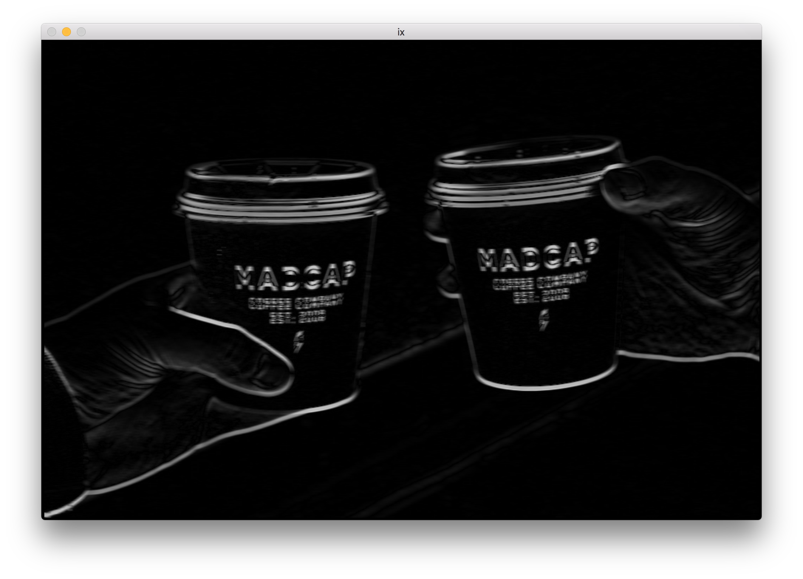
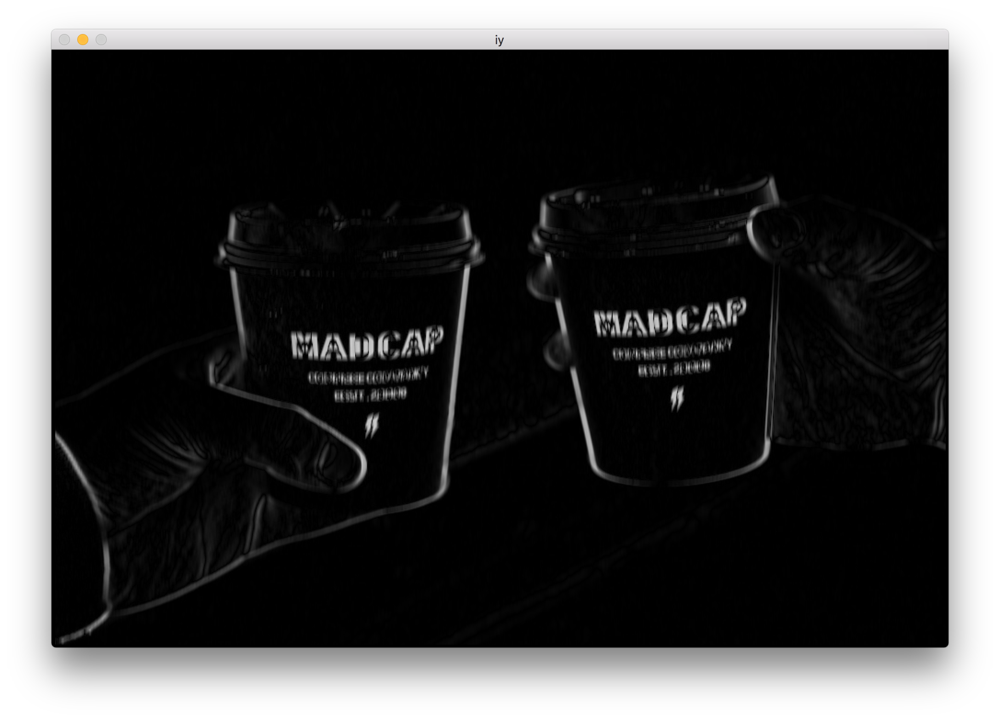
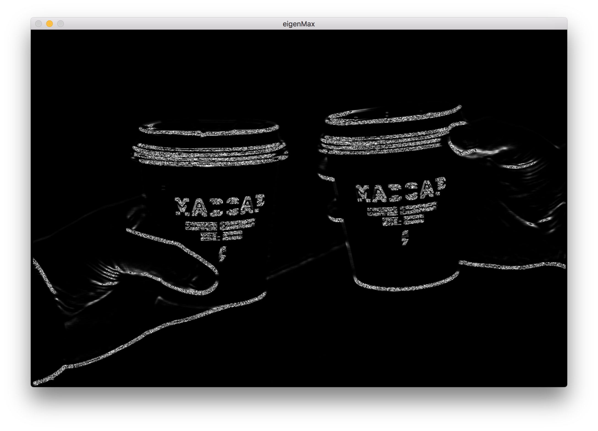
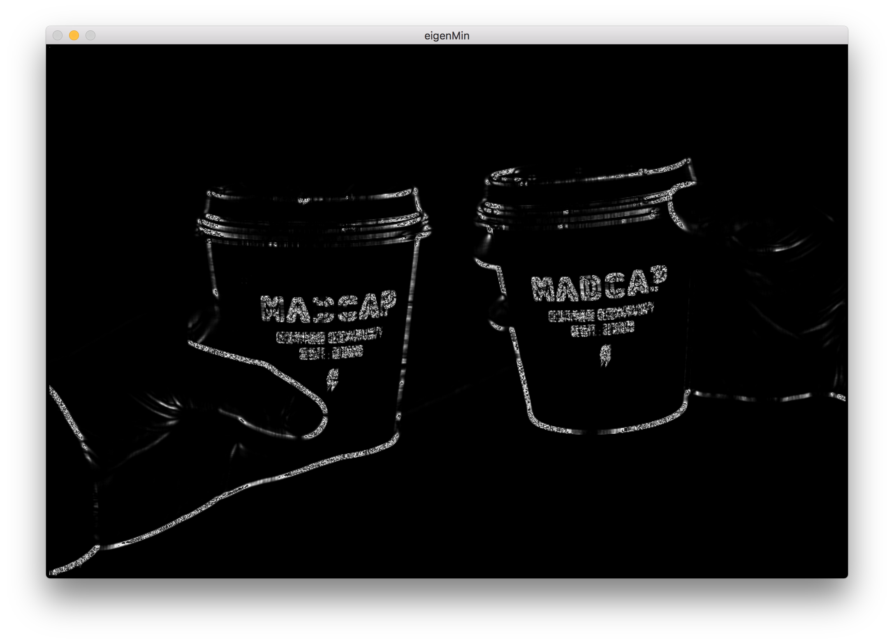
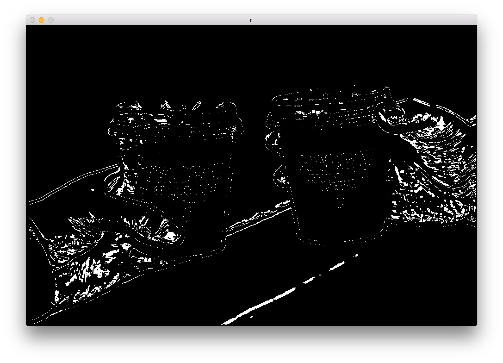
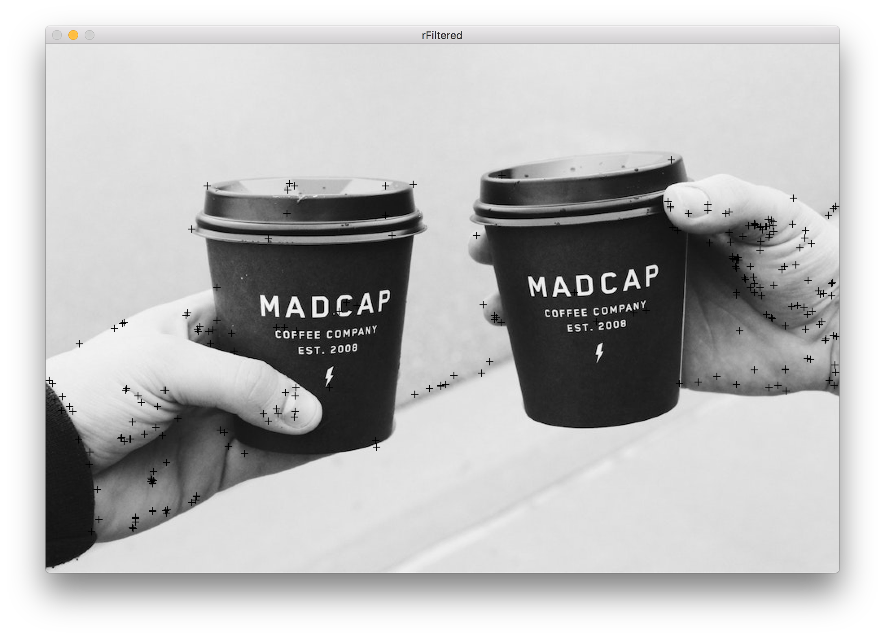

# 实验2实验报告

3150104785 郝广博 计算机科学与技术

## 实验目的和要求

对输⼊入的⼀一张彩⾊色图像，⾃自⼰己写代码实现Harris Corner检 测算法: 


1. 不不能直接调⽤用OpenCV⾥里里⾯面与Harris⻆角点检测相关的⼀一些函数;


2. 只能⽤用C/C++，不不能⽤用其他语⾔言；


3. GUI只能⽤用⾃自带的HighGUI，不不能⽤用QT或其他的；


4. 平台可以⽤用Windows， Linux, MacOS； 


5. 显示中间的处理理结果及最终的检测结果，包括最⼤大特征值图，最⼩小特 征值图，R图（可以考虑彩⾊色展示），原图上叠加检测结果等，并将这 些中间结果都输出成图像⽂文件;
 6. 命令格式： “xxx.exe 图⽚片⽂文件 k参数(=0.04) Aperture_size(=3)”


## 实验环境

- macOS 10.12
- cmake 3.8
- openCV 3.3

## 实验步骤

1. 将图像以灰度模式读入

   ```c++
   imgGray = imread(imagePath, CV_LOAD_IMAGE_GRAYSCALE);
   ```

2. 计算Ix和Iy

   ```c++
   void calculateIxAndIy(){
       for(int x=0; x<imgGray.rows; x++){
           for(int y=0; y<imgGray.cols; y++){
               if(x>=apertureSize&&x<imgGray.rows-apertureSize&&y>apertureSize&&y<imgGray.cols-apertureSize){
                   int tx=0;
                   int ty=0;
                   for(int i=-apertureSize; i<=apertureSize; i++){
                       tx+=(int)imgGray.at<uchar>(x+apertureSize, y+i);
                       tx-=(int)imgGray.at<uchar>(x-apertureSize, y+i);
                       ty+=(int)imgGray.at<uchar>(x+i, y+apertureSize);
                       ty-=(int)imgGray.at<uchar>(x+i, y-apertureSize);
                   }
                   ix.at<uchar>(x,y)=(uchar)abs(tx/(apertureSize*2+1));
                   iy.at<uchar>(x,y)=(uchar)abs(ty/(apertureSize*2+1));
               }else{
                   ix.at<uchar>(x,y)=0;
                   iy.at<uchar>(x,y)=0;
               }
           }
       }
   }
   ```

3. 计算最大特征值和最小特征值，同时计算R值

   ```c++
   void calculateR(){
       for(int x=0; x<imgGray.rows; x++){
           for(int y=0; y<imgGray.cols; y++){
               if(x>=apertureSize&&x<imgGray.rows-apertureSize&&y>apertureSize&&y<imgGray.cols-apertureSize){
                   Mat m = Mat(2, 2, CV_64FC1);
                   int ixVal=ix.at<uchar>(x,y)*ix.at<uchar>(x,y);
                   int iyVal=iy.at<uchar>(x,y)*iy.at<uchar>(x,y);
                   m.at<int>(0,0)=ixVal*ixVal;
                   m.at<int>(1,0)=ixVal*iyVal;
                   m.at<int>(0,1)=ixVal*iyVal;
                   m.at<int>(1,1)=iyVal*iyVal;
                   Mat evects = Mat(2, 2, CV_64FC1);
                   Mat evalues = Mat(1, 2, CV_64FC1);
                   eigen(m,evalues,evects);
                   int lambda1=evalues.at<int>(0,0);
                   int lambda2=evalues.at<int>(0,1);
                   eigenMaxImg.at<uchar>(x,y)=(uchar)(lambda1/65536);
                   eigenMaxInt.at<int>(x,y)=lambda1;
                   eigenMinImg.at<uchar>(x,y)=(uchar)(lambda2/65536);
                   eigenMinInt.at<int>(x,y)=lambda2;
                   double rVal=lambda1*lambda2 - k*(lambda1+lambda2)*(lambda1+lambda2);
                   if (rVal>10000000){
                       r.at<double>(x,y)=rVal;
                       rImg.at<uchar>(x,y)=255;
                       if(rVal>maxR){
                           maxR=rVal;
                       }
                   }else{
                       r.at<double>(x,y)=0;
                       rImg.at<uchar>(x,y)=0;
                   }
   //                printf("%d %d %f\n",lambda1, lambda2, rVal);
               }else{
                   r.at<double>(x,y)=0;
                   rImg.at<uchar>(x,y)=0;
                   eigenMaxImg.at<uchar>(x,y)=0;
                   eigenMinImg.at<uchar>(x,y)=0;
               }
           }
       }
   }
   ```

   这里同时还记录了最大的R值，用来在下一步做R值过滤。

4. 过滤R值得到最终检测结果，并且通过十字标记在原图上

   ```c++
   void filterR(){
       for(int x=0; x<imgGray.rows; x++) {
           for (int y = 0; y < imgGray.cols; y++) {
               rFiltered.at<int>(x,y)=0;
               if (x >= apertureSize && x < imgGray.rows - apertureSize && y > apertureSize && y < imgGray.cols - apertureSize) {
                   if(r.at<double>(x,y)>maxR*0.9){
                       rFiltered.at<int>(x,y)=1;
                       drawMarker(rFilteredImg, Point(y, x),  Scalar(0, 0, 255), MARKER_CROSS, 8, 1);
                   }
               }
           }
       }
   }
   ```

## 实验结果

原图


灰度


Ix



Iy



最大特征值



最小特征值



R值



筛选后的R值



## 讨论和分析

最终的检测结果不是特别的理想，个人觉得问题是出在了R值过滤的算法上了。现在是直接提取出大于最大R值`rMax`的0.9倍的所有点，所以导致了手部的检测结果点较多。如果采用局部最大值算法的话，可能效果会更好。