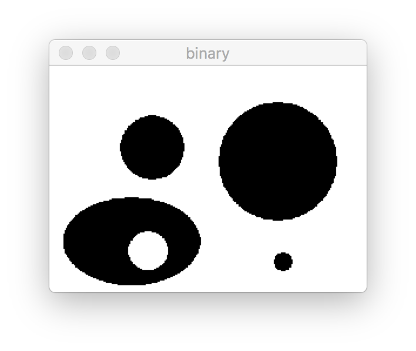
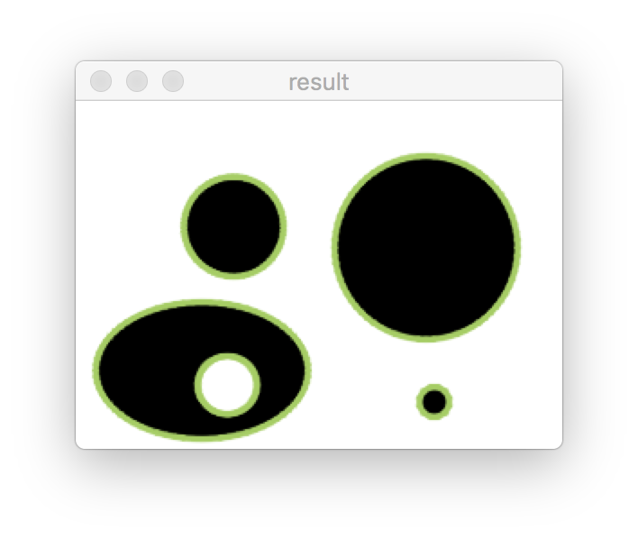
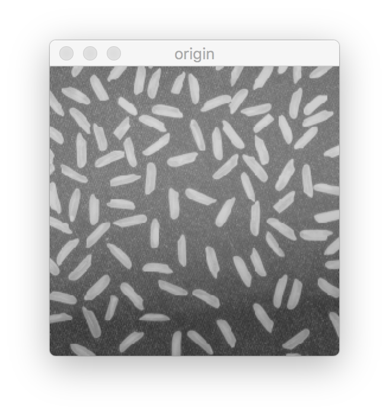
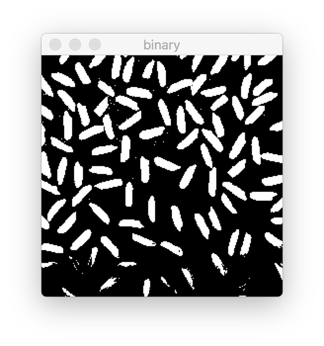
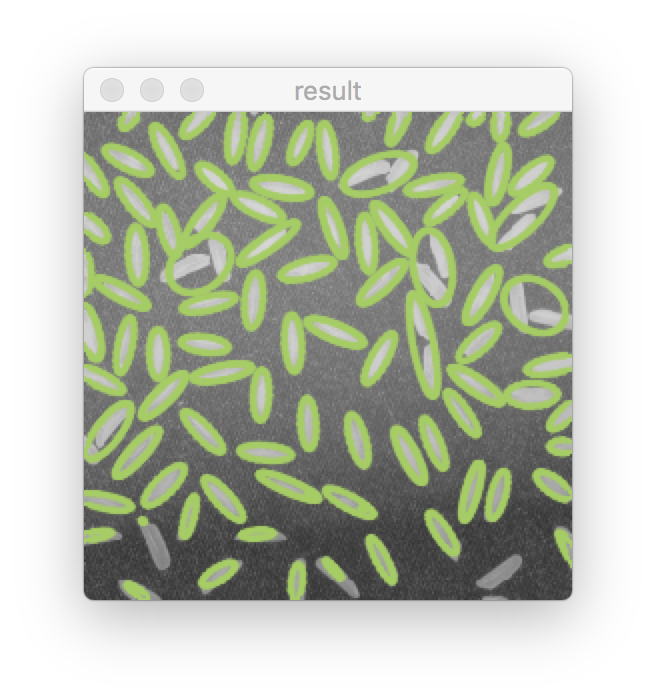

# 实验3实验报告

郝广博 3150104785

## 实验目的和要求

调⽤CvBox2D cvFitEllipse2( const CvArr* points )实现椭圆拟合

## 实验环境

- macOS 10.12
- cmake 3.8
- openCV 3.3

## 实验步骤

### 读入图像

分别用`COLOR`和`GRAYSCALE`模式，读入图像：

```c++
Mat originImg = imread(imgPath, CV_LOAD_IMAGE_COLOR);
Mat grayscaleImg = imread(imgPath, CV_LOAD_IMAGE_GRAYSCALE);
```

`grayscaleImg`是后面做拟合处理的时候用到的图像，而`originImg`是在得到拟合结果以后进行彩色标注使用的图像。

### 二值化

为了能够更准确的得到轮廓，需要先把图像二值化：

```c++
Mat binaryImg;
threshold(grayscaleImg, binaryImg, thresh, 255, CV_THRESH_BINARY);
```

这里的`thresh`是个参数，可以由用户手动输入，默认是`128`。

### 得到轮廓

调用openCV的`findContours`函数，进行轮廓提取：

```c++
vector<vector<Point>> contours;
findContours(binaryImg, contours, CV_RETR_LIST, CV_CHAIN_APPROX_SIMPLE);
```

### 椭圆拟合

遍历`contours`，利用openCV的`fitEllipse`进行椭圆拟合：

```c++
for(int i=0; i<contours.size(); i++){
    if(contours[i].size()<6)continue;
    Mat points;
    Mat(contours[i]).convertTo(points, CV_32FC3);
    RotatedRect box = fitEllipse(points);
    ellipse(originImg,box,Scalar(94, 206, 165), 2, LINE_AA);
}
```

在拟合完成后，把得到的拟合结果用绿色线条绘制在原图上。

## 实验结果

样例图片1（`thresh`设置为150）






样例图片2（`thresh`设置为150）







## 讨论和分析

一开始我忽略了二值化这一个步骤，导致样例图片1虽然可以正常识别，但是样例图片2就无法识别出结果了。后来通过调试发现是在`findContours`这一步就得不到正常的轮廓检测结果了。推测是样例图片2的色彩反差较小，不易识别轮廓。