# 实验4实验报告

郝广博 3150104785

## 实验目的和要求

⾃自⼰己写代码实现Eigenface⼈人脸识别的训练与识别过程

## 实验环境

- macOS 10.13
- cmake 3.9
- openCV 3.3

## 实验步骤

### 构建人脸库

人脸库在`face-library`文件夹下，其中共有16×11张人脸，每个人对应的11张人脸中，前十张`s1`到`s10`用来训练，最后一张`s11`留作测试用。

### 相关数据结构的定义

代码中定义了两个class：

```c++
class Face {
public:
    int id;
    Mat img;
    Person* person;
    Mat coordinates;
    explicit Face(Person* p, int id):person(p),id(id){}
};

class Person {
public:
    int id;
    vector<Face*> faces;
    explicit Person(int id):id(id){}
};

vector<Person*> persons;
vector<Face*> allFaces;
vector<Mat> allFaceMats;
```

`Face`是每个人对应的脸，是训练和识别中的最小单位，`Person`是不同的人，用来组织人脸图像。

### 读入人脸库

```c++
void readFaces(){
    for(int i=1; i<=16; i++){
        Person* person = new Person(i);
        persons.push_back(person);
        for(int j=1; j<=10; j++){
            Face* face = new Face(person, j);
            Mat img = imread("face-library/"+to_string(i)+"/s"+to_string(j)+".bmp", CV_LOAD_IMAGE_GRAYSCALE);
            resize(img, img, standardSize);
            face->img = Mat(standardSize.height, standardSize.width, CV_8UC1);
            img.copyTo(face->img);
            normalize(face->img, face->img, 255, 0, NORM_MINMAX);
            allFaceMats.push_back(face->img);
            person->faces.push_back(face);
            allFaces.push_back(face);
        }
    }
    testImg = imread(testImgPath,CV_LOAD_IMAGE_GRAYSCALE);
    resize(testImg, testImg, standardSize);
    normalize(testImg, testImg, 255, 0, NORM_MINMAX);
}
```

遍历人脸库文件夹，通过`imread`读入图像，并且进行缩放和直方图的归一化，同时构建相应的`Face`和`Person`对象。

### 计算均值矩阵和协方差矩阵

```c++
calcCovarMatrix(allFaceMats,covarMat,meanMat,COVAR_NORMAL);
Mat meanImg;
meanMat.convertTo(meanImg, CV_8UC1);
```

通过openCV提供的`calcCovarMatrix`函数，可以进行协方差矩阵和均值矩阵的计算。

### 计算特征脸和构建映射空间

```c++
eigen(covarMat,eigenValues,eigenVectors);
eigenCount = eigenVectors.rows*energyPercent;
cout<<"eigen count: "<<eigenCount<<endl;
AT = Mat(eigenCount, standardSize.height*standardSize.width, CV_64F);
A = Mat(standardSize.height*standardSize.width,eigenCount,CV_64F);
for(int i=0; i<eigenCount; i++){
    Mat t = Mat(standardSize.height, standardSize.width, CV_64F);
    Mat tt = Mat(standardSize.height, standardSize.width, CV_8UC1);
    for(int j=0; j<standardSize.width*standardSize.height; j++){
        t.at<double>(j/standardSize.width,j%standardSize.width)=eigenVectors.at<double>(i,j);
        AT.at<double>(i,j)=eigenVectors.at<double>(i,j);
        A.at<double>(j,i)=eigenVectors.at<double>(i,j);
    }
    normalize(t,t,255,0,NORM_MINMAX);
    t.convertTo(tt,CV_8UC1);
    eigenFaces.push_back(tt);
}
```

通过openCV提供的`eigen`函数，可以计算出协方差矩阵`covarMat`的特征向量，根据程序运行时输入的`energyPercent`，取出前一部分的特征向量，得到映射空间`A`及其转置矩阵`AT`。

### 识别

```c++
cout<<testImg.reshape(0,1).rows<<"*"<<testImg.reshape(0,1).cols<<endl;
Mat testDoubleMat;
testImg.reshape(0,1).convertTo(testDoubleMat, CV_64F);
Mat testCoordinates = testDoubleMat * A;
double minDistance = -1;
Face* resultFace;
for(vector<Face*>::iterator iter=allFaces.begin(); iter!=allFaces.end(); iter++){
    double distance;
    Face* face = *iter;
    Mat doubleMat;
    face->img.reshape(0,1).convertTo(doubleMat, CV_64F);
    face->coordinates = doubleMat * A;
    distance = 0;
    for(int i=0; i<eigenCount; i++){
        distance += pow(face->coordinates.at<double>(0,i)-testCoordinates.at<double>(0,i), 2);
    }
    if(distance<minDistance || minDistance==-1){
        minDistance = distance;
        resultFace = face;
    }
}
```

计算出每个人脸图像在映射空间A中对应的坐标，并且同时求出它和测试图像在A中的坐标的距离（代码中实际上求得的是欧式距离的平方，不过并不影响实验结果）。

取距离测试图像对应坐标最近的那一张人脸图像为识别结果，并且进行输出。

## 实验结果

### 编译

```bash
cmake . && make
```

### 运行

```bash
./hw4 0.03 ./face-library/16/s11.bmp
```

### 均值脸

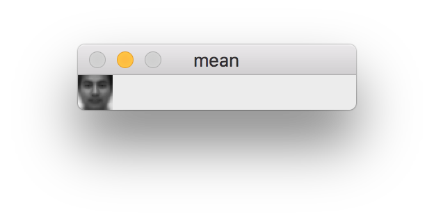

### 特征脸

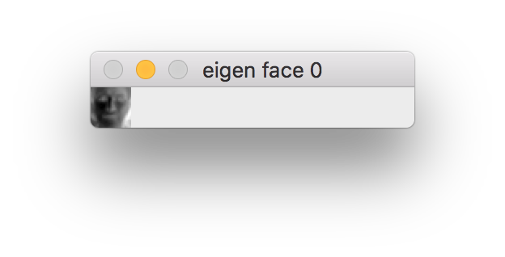


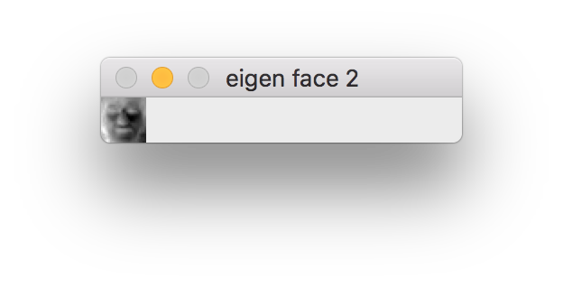

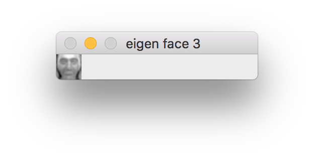


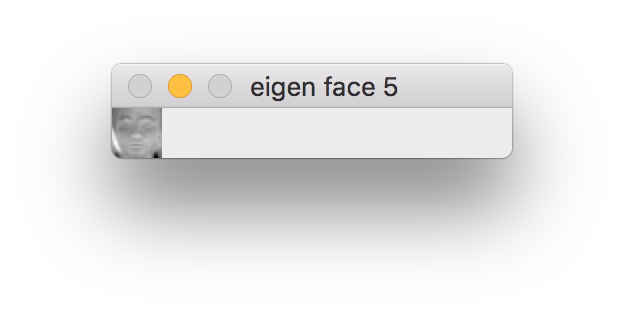

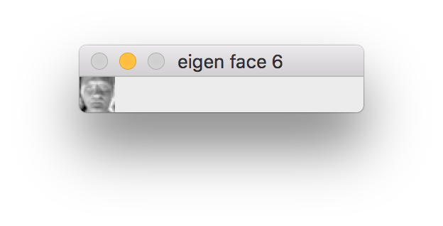

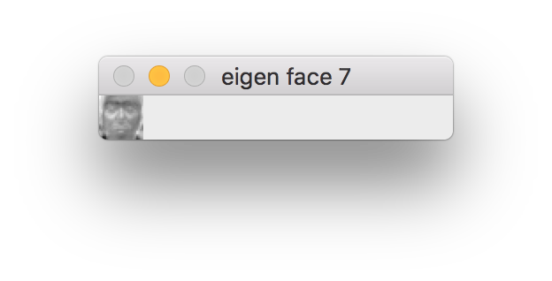

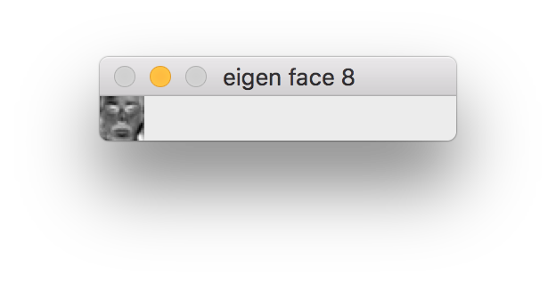

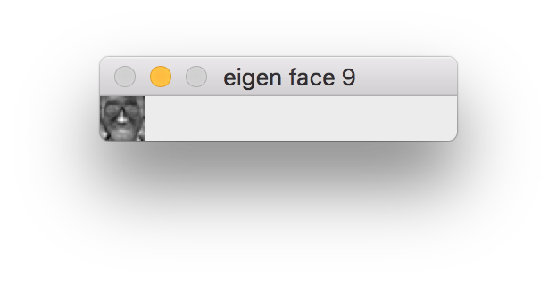

### 检测结果

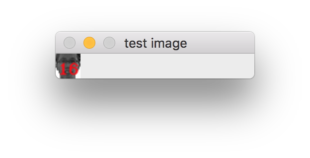

识别为16号，结果正确

### 最相似图像

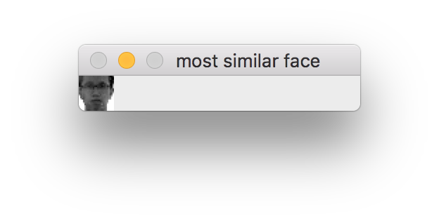

最相似的图像是16号的图片10

## 讨论和分析

在计算每张人脸图像在映射空间A中对应的坐标时，我并没有完全按照PPT上的 y=A^T^×f 进行计算，而是利用了转置矩阵的特性，通过 y^T^=f^T^×A计算出y^T^。这是因为openCV中提供了`reshape()`函数，这函数可以把二维的图像矩阵变成1行x列的一维矩阵。所以用后面的这个公式进行计算时，会较为简便。